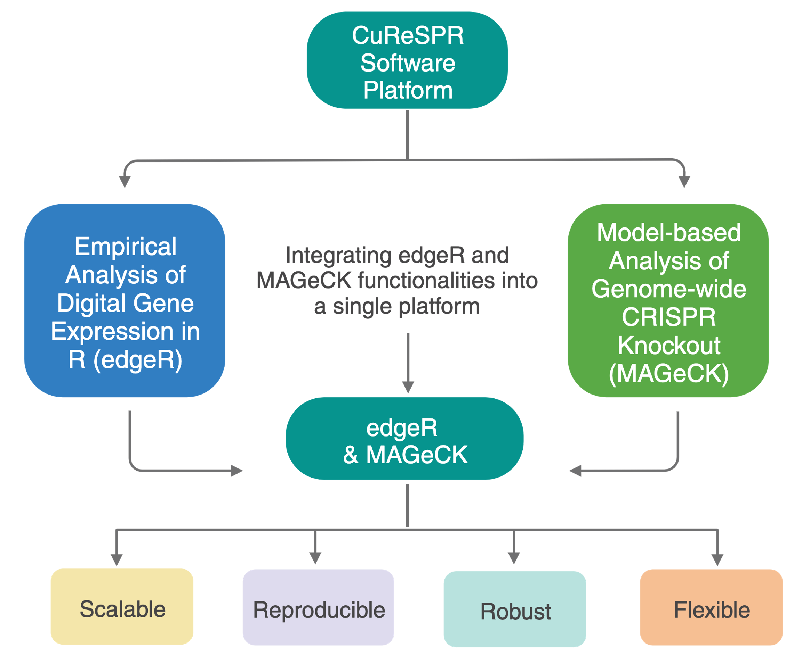
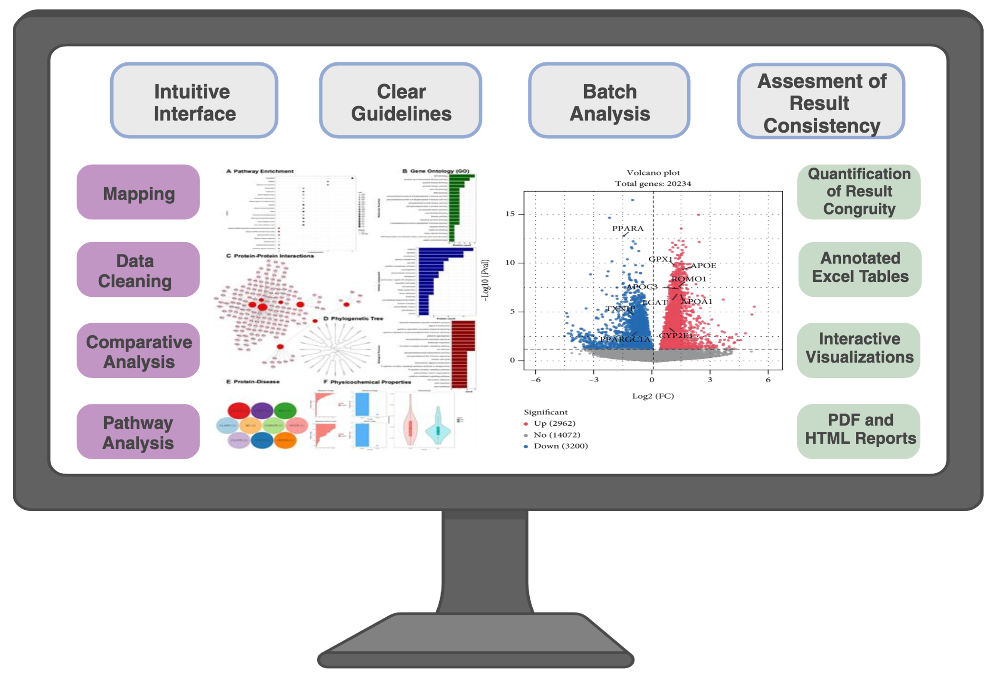

<!-- badges: start -->

<!-- badges: end -->

# `CuReSPR` software platform with R: Enabling breakthroughs in cancer cures through a seamless genome editing analysis of CRISPR screens. 

`CuReSPR` is a software platform integrating two robust genomics data analysis libraries: `edgeR` (Empirical Analysis of Digital Gene Expression in `R`) and `MAGeCK` (Model-based Analysis of Genome-wide CRISPR Knockout) to analyse genome editing data.  Genome editing allows researchers to selectively modify genes in an organism. One of the most powerful and versatile tools for genome editing is *Clustered Regularly Interspaced Short Palindromic Repeats (CRISPR)*. CRISPR genome editing offers precise modifications with minimal off-target effects, reducing the risk of unintended genetic alterations. Its simplicity, cost-effectiveness, and accessibility have outshone earlier genome-editing technologies.  
Also in recent years, CRISPR genome editing has sparked innovative breakthroughs in cancer research. This technology has unlocked new avenues for understanding tumour growth, metastasis, and drug resistance, and has accelerated the development of precise therapies and personalized treatment strategies. The clinical trials targeting hematologic malignancies using CRISPR-mediated gene knockout or engineered immune cells exemplify the transformative impact of translating CRISPR insights into tangible medical interventions in cancer research.  
While strides have been made in cancer research, computational methodologies for CRISPR-based genome editing continue to evolve, encountering unique challenges. Analysing CRISPR screens in the cancer context is particularly challenging due to the disease's heterogeneity, defined by diverse molecular subtypes. Thus, a sophisticated bioinformatics platform is essential to ensure data quality and extract insights from the cancer data derived from CRISPR screens. Existing software offers varying functionalities but lacks a standardised computational pipeline and falls short in handling the intricacies inherent to cancer genome editing data. These limitations hinder cancer researchers, diverting their focus from biological insights to managing multiple tools for a comprehensive understanding of genome editing results in cancer experiments.  
`CuReSPR` introduces a seamless software platform designed to analyse genome editing data to investigate cancer biology. This platform integrates two robust CRISPR data analysis libraries: `edgeR` and `MAGeCK`. The `edgeR` and `MAGeCK` are both designed to identify genes that differentiate between biological conditions, but they both have their strengths and weaknesses in the context of CRISPR genome editing. `edgeR` offers comprehensive analysis and visualization but lacks CRISPR-specific features. `MAGeCK` excels in CRISPR analysis but demands proficiency in programming languages and a steep learning curve. Furthermore, both tools struggle to handle the inherent variability of cancer data. A critical addition to `CuReSPR` involves incorporating innovative data-cleaning options to specifically address the challenges posed by the sparsity and variability of cancer data.  

`CuReSPR` bridges the gap in the CRISPR screen analysis of cancer experiments by presenting a user-friendly platform that harnesses the strengths of `edgeR` and `MAGeCK` while addressing their shortcomings.  
`CuReSPR`:  
1. Integrates EdgeR and MAGeCK functionalities into a cohesive platform.
2. Incorporates advanced data cleaning options necessary for cancer experiments.
3. Offers user-friendly interfaces with clear guidelines for analysis steps.
4. Provides visualization tools for enhanced interpretation.
5. Facilitates batch analysis and multiple data set comparisons.
6. Allows users to export results and customizable reports.

